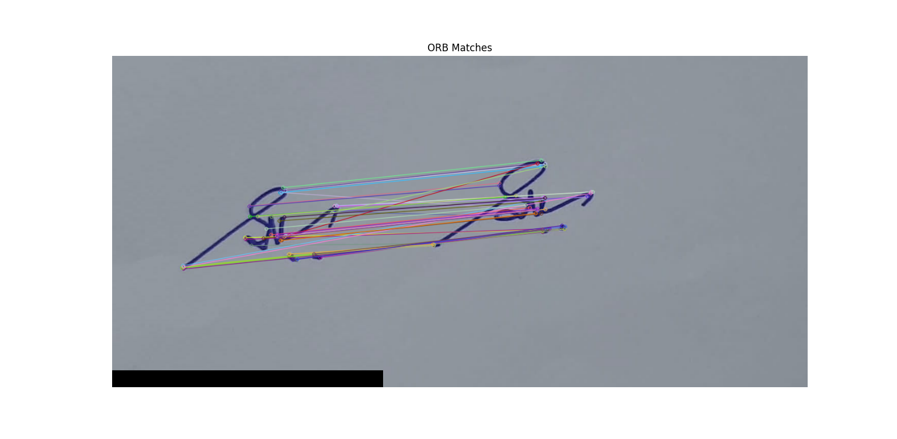

# Signature-Verification 

# 🖼️ Image Comparison using K-Means Clustering and ORB Features

This project compares two images based on:

- 🎨 **Color similarity** using K-Means clustering in the HSV color space.
- 🧠 **Structural similarity** using ORB (Oriented FAST and Rotated BRIEF) feature matching.

It provides a combined decision based on these metrics to determine whether the two input images are similar.

---

## 🚀 Features

- K-Means clustering on pixel color data (HSV) to calculate color distance.
- ORB feature extraction and matching to analyze image structure.
- Visualization of:
  - Input images
  - Feature matches between the two images
- Printed summary of:
  - K-Means color distance
  - Number of ORB matches
  - Final similarity verdict

---

## 🖼️ Sample Output

Here’s a preview of the ORB keypoint matching:

